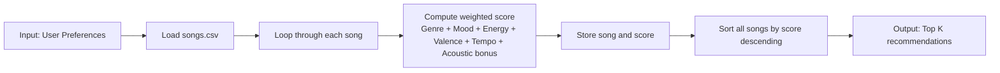
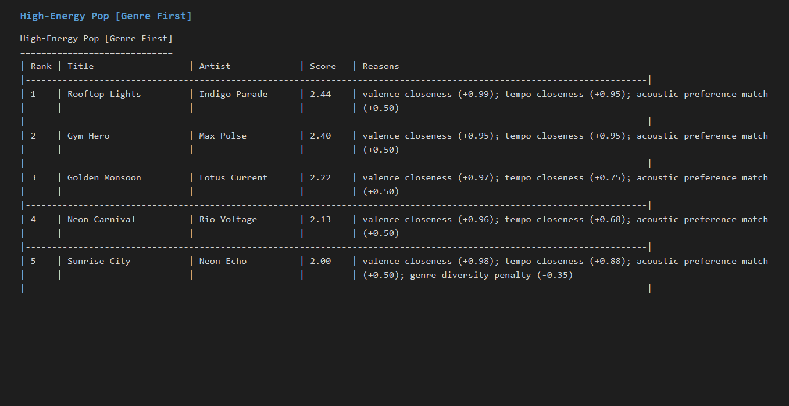
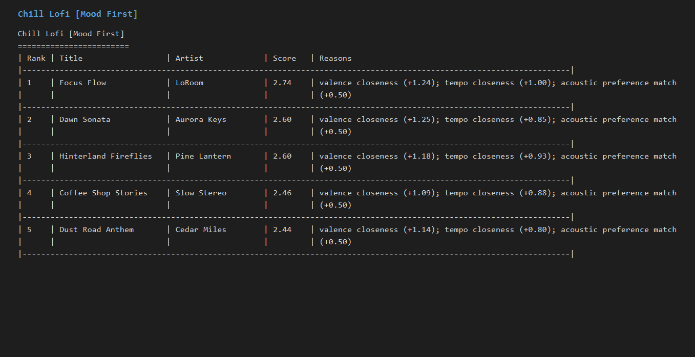
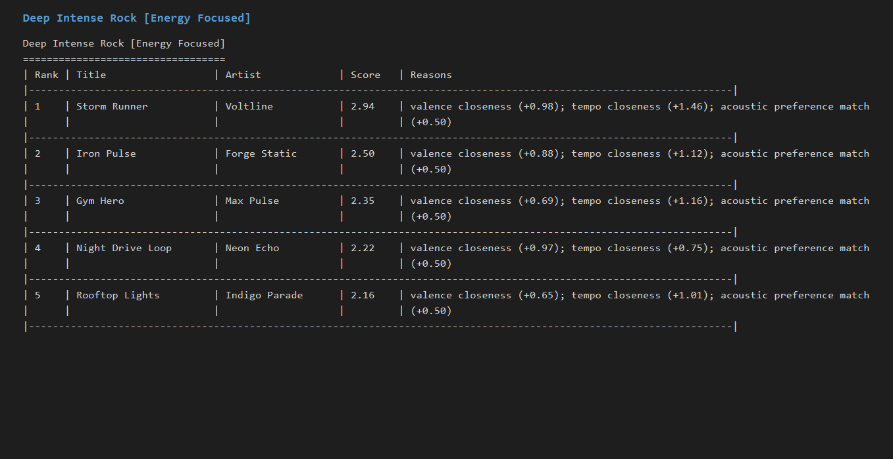
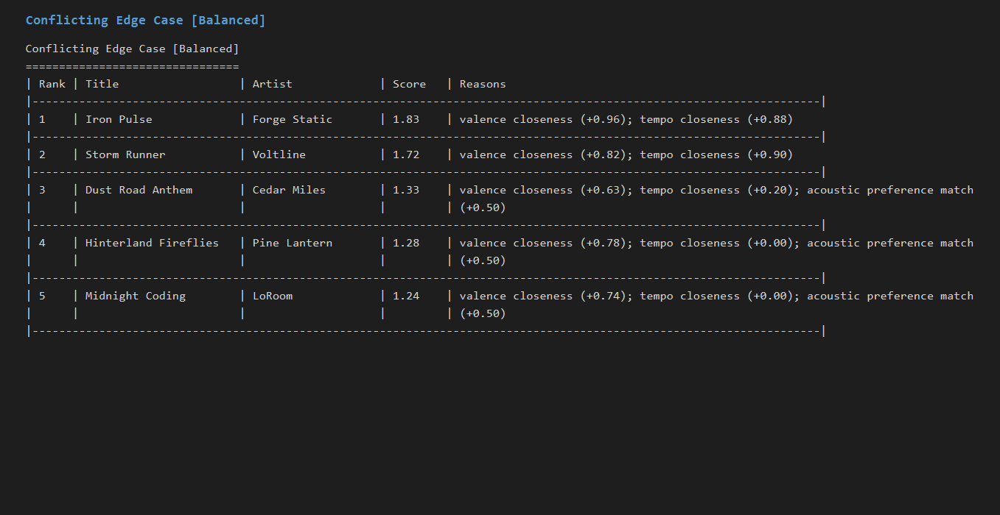

# 🎵 Music Recommender Simulation

## Project Summary

In this project you will build and explain a small music recommender system.

Your goal is to:

- Represent songs and a user "taste profile" as data
- Design a scoring rule that turns that data into recommendations
- Evaluate what your system gets right and wrong
- Reflect on how this mirrors real world AI recommenders

Replace this paragraph with your own summary of what your version does.

This project simulates a content-based music recommender that predicts what a user may like next by matching song attributes to a simple taste profile. Real platforms (for example Spotify and YouTube) usually combine collaborative filtering (patterns from similar users: likes, skips, repeats, playlists, watch/listen sessions) with content-based filtering (attributes of the item itself: genre, tempo, mood, energy, acousticness, language, and metadata). In this classroom version, I prioritize transparent content signals so each recommendation can be explained directly from song features.

---

## How The System Works

Explain your design in plain language.

I expanded the catalog from 10 to 18 songs in `data/songs.csv` and made it more diverse across genres and moods so the recommender can learn clearer differences between styles (for example classical-serene vs metal-aggressive vs lofi-chill).

Final UserProfile for simulation testing:

```python
user_profile = {
   "favorite_genre": "lofi",
   "favorite_mood": "chill",
   "target_energy": 0.40,
   "target_valence": 0.60,
   "target_tempo_bpm": 82,
   "likes_acoustic": True,
}
```

Profile critique and refinement:

- This profile is not too narrow because it includes both categorical preferences (`genre`, `mood`) and numeric vibe targets (`energy`, `valence`, `tempo_bpm`).
- It should clearly separate intense rock/metal from chill lofi because those tracks differ strongly on `mood`, `energy`, and `tempo_bpm`.

Final Algorithm Recipe:

1. For each song, start with score = 0.
2. Add +2.0 if `song.genre == favorite_genre`.
3. Add +1.0 if `song.mood == favorite_mood`.
4. Add energy similarity points using closeness, not magnitude:
   `energy_points = 2.0 * max(0, 1 - abs(song.energy - target_energy))`
5. Add valence similarity points:
   `valence_points = 1.0 * max(0, 1 - abs(song.valence - target_valence))`
6. Add tempo similarity points:
   `tempo_points = 1.0 * max(0, 1 - abs(song.tempo_bpm - target_tempo_bpm) / 80)`
7. Add +0.5 acoustic bonus when `likes_acoustic` aligns with song acousticness threshold.
8. Save `(song, score)` for every row.
9. Sort by score descending and return Top K songs.

Data flow map:



Potential bias note:

- This system may over-prioritize genre labels and under-recommend cross-genre songs that match the same emotional vibe.
- Because weights are hand-tuned, it may reflect my personal assumptions of what matters most in music taste.

CLI verification snapshot:

```text
Loaded songs: 18

Top recommendations

========================================================================
1. Sunrise City by Neon Echo
   Score   : 7.34
   Reasons : genre match (+2.0); mood match (+1.0); energy closeness (+1.96); valence closeness (+0.91); tempo closeness (+0.97); acoustic preference match (+0.5)
------------------------------------------------------------------------
2. Gym Hero by Max Pulse
   Score   : 6.07
   Reasons : genre match (+2.0); energy closeness (+1.74); valence closeness (+0.98); tempo closeness (+0.85); acoustic preference match (+0.5)
------------------------------------------------------------------------
3. Rooftop Lights by Indigo Parade
   Score   : 5.31
   Reasons : mood match (+1.0); energy closeness (+1.92); valence closeness (+0.94); tempo closeness (+0.95); acoustic preference match (+0.5)
------------------------------------------------------------------------
```

Screenshot insert location:






If you keep the image in a different folder, update the path to match where you save it.

Experiment note:

- I also tested a weight shift where energy mattered more and genre mattered less, which made the results feel more responsive to tempo and mood but slightly less stable when two songs were close together.

Some prompts to answer:

- What features does each `Song` use in your system
  - For example: genre, mood, energy, tempo
- What information does your `UserProfile` store
- How does your `Recommender` compute a score for each song
- How do you choose which songs to recommend

You can include a simple diagram or bullet list if helpful.

---

## Getting Started

### Setup

1. Create a virtual environment (optional but recommended):

   ```bash
   python -m venv .venv
   source .venv/bin/activate      # Mac or Linux
   .venv\Scripts\activate         # Windows

   ```

2. Install dependencies

```bash
pip install -r requirements.txt
```

3. Run the app:

```bash
python -m src.main
```

### Running Tests

Run the starter tests with:

```bash
pytest
```

You can add more tests in `tests/test_recommender.py`.

---

## Experiments You Tried

Use this section to document the experiments you ran. For example:

- What happened when you changed the weight on genre from 2.0 to 0.5
- What happened when you added tempo or valence to the score
- How did your system behave for different types of users

---

## Limitations and Risks

Summarize some limitations of your recommender.

Examples:

- It only works on a tiny catalog
- It does not understand lyrics or language
- It might over favor one genre or mood

You will go deeper on this in your model card.

---

## Reflection

Read and complete `model_card.md`:

[**Model Card**](model_card.md)

Write 1 to 2 paragraphs here about what you learned:

- about how recommenders turn data into predictions
- about where bias or unfairness could show up in systems like this

---

## 7. `model_card_template.md`

Combines reflection and model card framing from the Module 3 guidance. :contentReference[oaicite:2]{index=2}

```markdown
# 🎧 Model Card - Music Recommender Simulation

## 1. Model Name

Give your recommender a name, for example:

> VibeFinder 1.0

---

## 2. Intended Use

- What is this system trying to do
- Who is it for

Example:

> This model suggests 3 to 5 songs from a small catalog based on a user's preferred genre, mood, and energy level. It is for classroom exploration only, not for real users.

---

## 3. How It Works (Short Explanation)

Describe your scoring logic in plain language.

- What features of each song does it consider
- What information about the user does it use
- How does it turn those into a number

Try to avoid code in this section, treat it like an explanation to a non programmer.

---

## 4. Data

Describe your dataset.

- How many songs are in `data/songs.csv`
- Did you add or remove any songs
- What kinds of genres or moods are represented
- Whose taste does this data mostly reflect

---

## 5. Strengths

Where does your recommender work well

You can think about:

- Situations where the top results "felt right"
- Particular user profiles it served well
- Simplicity or transparency benefits

---

## 6. Limitations and Bias

Where does your recommender struggle

Some prompts:

- Does it ignore some genres or moods
- Does it treat all users as if they have the same taste shape
- Is it biased toward high energy or one genre by default
- How could this be unfair if used in a real product

---

## 7. Evaluation

How did you check your system

Examples:

- You tried multiple user profiles and wrote down whether the results matched your expectations
- You compared your simulation to what a real app like Spotify or YouTube tends to recommend
- You wrote tests for your scoring logic

You do not need a numeric metric, but if you used one, explain what it measures.

---

## 8. Future Work

If you had more time, how would you improve this recommender

Examples:

- Add support for multiple users and "group vibe" recommendations
- Balance diversity of songs instead of always picking the closest match
- Use more features, like tempo ranges or lyric themes

---

## 9. Personal Reflection

A few sentences about what you learned:

- What surprised you about how your system behaved
- How did building this change how you think about real music recommenders
- Where do you think human judgment still matters, even if the model seems "smart"
```
